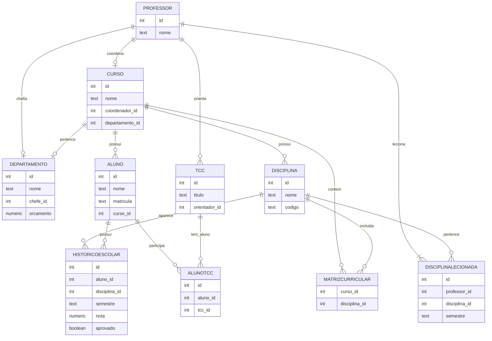

# UniversidadeBD

### Integrantes
Nome: Gabriel Lovato Camilo de Campos 22.123.004-8

Nome: Theo Zago Zimmermann 22.123.035-2

## Descrição do Projeto

Este projeto tem como objetivo criar um sistema acadêmico simples para gerenciar informações de uma universidade, como professores, departamentos, cursos, alunos, disciplinas, TCCs e histórico escolar. O sistema permite o cadastro e a atualização de dados em um banco de dados PostgreSQL, utilizando a linguagem Python com a biblioteca psycopg2. O projeto também inclui um menu interativo em Python para facilitar a inserção de dados no banco de forma prática.

## Como Executar o Projeto

1. Criar o Banco de Dados
    
     Como Por Exemplo:
   
         CREATE DATABASE Universidade;

2. Criar as tabelas relacionadas a uma universidade
   
    Depois de criar o banco de dados e conectar-se, deve se inserir as tabelas necessárias e executar o arquivo DDLTables.sql (conforme o GitHub)

3. Configurar o Ambiente que irá executar o código

    Após ter criado as tabelas necessárias, deve-se instalar a biblioteca: pip install psycopg2.

    Deve fazer a conexão com o Banco de Dados, conforme exemplo:

       host = "localhost"
       database = "Universidade"
       user = "postgres"
       password = "sua_senha"
       port = 5432

    Após isso, copiar o código do arquivo banco.py e executar(Conforme o GitHub). Rodando o código irá gerar um menu interativo, que por vez, na primeira vez que for inserir os dados, se seguir a numeração do menu, não terá nenhum problema. Após ter feito todas as inserções necessárias, pode inserir conforme quiser.
    
## Diagrama Modelo Entidade Relacionamento (MER)

## Digrama Modelo Relacional

